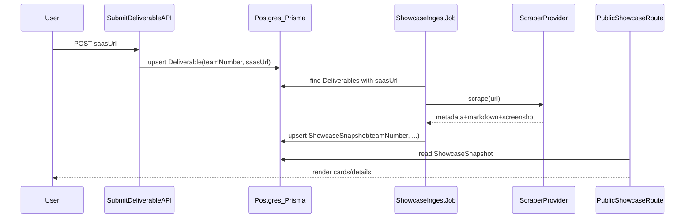

## Goals

- Build a reliable way to **gather context** from each team’s submitted `saasUrl` and display it on a public `/showcase` route.
- Handle unknown tech stacks (Next/React/anything) by delegating rendering/extraction to **Firecrawl**.

## Why Firecrawl (and cost)

- **Capability fit**: Firecrawl `/scrape` handles JS-rendered SPAs, proxies, caching, and returns **clean markdown + metadata**. It can also return **screenshots**, **links**, and **structured JSON**.\n+- **Cost**: `/scrape` is **1 credit per page** and the Free plan includes **500 one-time credits**. With **~50 teams × 1 landing page**, you’ll use **~50 credits**, so the scrape cost is effectively **$0**.\n+- **Scope discipline**: Avoid `/extract` for this use case (dynamic pricing). Stick to `/scrape` with explicit formats.

## Implementation approach (Firecrawl-first)

## Phases (handoff-friendly)

### P0 — Design + guardrails (parallelizable)

- Output contract for what the showcase needs from a scrape.
- URL validation/SSRF protections and ingestion authorization.
- UI wireframe for `/showcase` (grid + detail + empty/error states).

### P1 — Data model + storage (mixed)

- Add `ShowcaseSnapshot` model and ship migration (sequential; blocks ingestion work).
- Decide screenshot storage strategy (can be worked in parallel but should be finalized before UI).

### P2 — Firecrawl integration (parallelizable)

- Firecrawl config + client wrapper + `scrapeSaasLanding(url)` implementation.
- Optional summary step and stable error mapping.

### P3 — Ingestion pipeline (mostly sequential)

- Admin ingestion route/job to backfill + refresh snapshots (idempotent, resumable).
- Add ops controls (concurrency, retries, logging).

### P4 — Public showcase UI (parallelizable once P1 is stable)

- `/showcase` grid + per-team detail route(s) driven entirely from stored snapshots.
- Card component, empty/error states, and i18n copy.

### P5 — QA + ops polish (parallelizable)

- QA fixtures + checklist; admin observability and retry tooling.

### Scrape + store a snapshot per team

- For each `Deliverable.saasUrl`, call Firecrawl `/scrape` and request formats:\n+  - `markdown` (for summary + searchable text)\n+  - `screenshot` (for showcase card)\n+  - `links` (optional: “key links”)\n+  - (Include page metadata/OG fields from Firecrawl’s returned `metadata` block)\n+- Persist the result as a `ShowcaseSnapshot` so the public showcase route never scrapes on view.\n+- Optional: run a second pass to produce a short `summary` (either via Firecrawl’s `summary` format or your existing LLM), then store it.\n+\n+### Fallback policy (minimal)\n+\n+- If Firecrawl fails (rate-limited, blocked site, invalid URL), store `fetchError` and render the showcase card with whatever you already have (team number + source URL) plus an error badge.\n+- Re-try ingestion later via the same job.

## Where this fits in your repo

- You already capture the SaaS URL via `Deliverable.saasUrl` in Prisma (`prisma/schema.prisma`) and submit it via `[src/app/api/portal/submit-deliverable/route.ts](src/app/api/portal/submit-deliverable/route.ts)`.
- Add a new persisted model (e.g. `ShowcaseSnapshot`) keyed by `teamNumber` to store:
  - `sourceUrl`, `title`, `description`, `ogJson`, `markdown`, `summary`, `screenshotUrl` (or stored blob), `lastFetchedAt`, `fetchError`
  - (You already do something similar for social posts in `SocialPost.ogJson`, `fetchError`, `lastFetchedAt`.)

## Data flow (high level)

## Operational details

- **Run mode**: scrape on-demand (admin button / cron) not on every request.
- **Timeouts**: keep tight defaults and mark failures in `fetchError`.
- **Caching/refresh**: store snapshot; optionally refresh if older than N hours.
- **Security**: block internal IP ranges and non-http(s) URLs when fetching.

## Decision guidance

- **Default**: Firecrawl Cloud. For this hackathon scope (50 single-page scrapes), it’s the simplest path and effectively **$0**.

